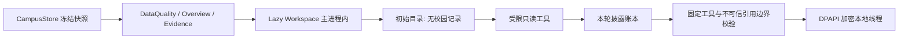

# P6 数据流与惰性 Agent 审计

更新日期：2026-08-15。

P6 不再采用“用户勾选领域，再把预投影上下文发送给模型”的设计。现在所有已同步的校园数据都驻留在主进程的本地 Agent 工作区，模型在真正需要时自行调用固定工具读取受限切片；用户不需要为学籍身份或任何已保存校园数据再次授权。详见 [内嵌顾问与本地 Agent](20-a-b-c-advisor-agent-sidecar.md)。

## 数据流

工作区创建后不再读实时 `CampusStore`，所以发送前若 revision 改变，整个运行会失败并要求重新提问。工具结果只由该冻结快照生成；没有后台同步、登录、网页请求或学校侧写操作。若生成期间出现新快照，回答保留其原始快照身份，并在界面中作为轻量状态提示，不混入“未确定”段落。

## 初始目录与工具结果

初始 `theia-advisor-agent-session/v1` 只含：

- 用户问题；
- snapshot revision。

它不含任何课程名、成绩、GPA、考试、作业、课表行、通知、邮件、正文、体测值、源 URL、原始 HTML、路径、Cookie、密码、授权码或 API Key。

固定工具边界由 system prompt 提供，不放入会话对象。具体事实通过工具返回时，工作区会登记 claim/evidence 或低信任 reference。最终回答的每个事实只能引用已经登记的 ID。未调用工具时，模型即使猜到 ID 也会被拒绝。

## 长期安全约束

| 数据 | 可供 Agent 使用 | 外发方式 | 不能外发 |
| --- | --- | --- | --- |
| 学籍档案、教务、课程、课表、考试、成绩、作业、学业树 | 是 | 按工具、按问题、最多 12 条受限记录；档案可含姓名、学号、院系、专业、年级、班级 | 原始页面、URL、会话 |
| 通知、邮箱 | 是 | 低信任净化记录；正文须先检索再读 | HTML、附件二进制、远端标识 |
| 体测、校历、全校课表、抢课目标缓存 | 是 | 按工具白名单投影 | 本地文件路径、原始导入文档 |
| 密码、Cookie、浏览器 profile、API Key | 否 | 永不 | 永不 |
| 线程历史 | 本地可读 | 仅发送有界的导航提示；完整 transcript 不自动外发 | 自动会话摘要、后台导出 |

禁止能力恒为：`filesystem`、`arbitrary-url`、`network`、`browser-session`、`credentials`、`sync`、`login`、`course-selection-execution`、`answer-fill`、`mail-send`、`upload`、`submit`、`shell`、`ipc-proxy`。

课程作业后台队列仍是独立暂停事项，不得与顾问 Agent 合并或借 Agent 权限启动。
