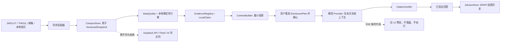

# P6 数据流审计与开放式只读 Agent 方案

更新日期：2026-08-14

本文件是 P6 的安全边界与交付顺序。它把两条不能混淆的路线拆开：原路线的“课程作业后台队列”，以及用户要求的“可自定义数据授权、自由工具 Agent、持久对话、流式输出”。两者共用模型传输安全层，但绝不共享学校操作权限、作业工作区文件权限或浏览器会话。

> 2026-08-14 状态更新：课程作业后台队列按用户要求暂停。A 的加密持久线程和流式预览、B 的受限真实只读工具循环、C 的现有可校验导出/sidecar 合同，以及四种模型协议适配已完成当前首发实现；以 [A/B/C 顾问、Agent 与 Sidecar](20-a-b-c-advisor-agent-sidecar.md) 为准。本文件保留原 P6 设计和隔离理由，不能再将“真实工具循环未实现”当作当前状态。

## 当前实现状态

本轮已落地的基础能力：

- 顾问对话记录由独立 `AdvisorStore` 保存到用户数据目录的 `advisor/threads.v1.dpapi.json`；每条线程单独经 Windows DPAPI 加密、附带密文摘要、原子写入和串行写入。它不写入 `CampusState`、loopback API、THEIA Feed 或 AI 导出包。
- 应用启动时仅在 DPAPI 可用且记录可解密时恢复线程；损坏记录只隔离该记录并记录脱敏诊断，不会阻塞校园数据加载。
- `ModelService.requestStream()` 已实现有上限的 SSE 流式传输：固定模型端点、原有 DNS 固定与 dispatcher 清理、90 秒截止时间、Abort、请求/响应字节上限均继续生效。
- 页面可显示流式文本预览。预览不是顾问结论，不会写入对话历史，也不能触发任何动作；只有流结束后通过完整 `CitationVerifier` 的最终回答才会显示为已验证回答并持久化。
- P6 数据授权合同与只读工具合同已实现为纯模块。工具只读取已投影的顾问总览，既拿不到文件路径、原始页面、Cookie、密码、模型 Key、网络对象，也拿不到任意 IPC 句柄。

本轮没有把下列内容伪装成已完成：

- 作业 `AutoQueue`、崩溃恢复、完成 outbox 与本机通知仍是原 P6 的独立工作项。
- 用户可保存的自定义授权面板、跨服务身份的策略管理和真正的多步模型工具循环尚未接入运行时。当前的政策/工具模块是接线前的强制合同，不是隐藏开关。
- 历史对话默认不会再次发送给模型。持久化只是本机历史；“发送受预算限制的会话摘要”必须由用户逐次选择并在披露窗中显示。

## 全链路审计

| 数据类别 | 唯一事实来源 | 本地可持久化 | 默认可出站 | 可成为工具结果 | 撤销或删除后的效果 |
|---|---|---:|---:|---:|---|
| 课表、考试、成绩、培养方案、课程、作业 | `CampusStore` 冻结快照 | 是 | 仅按意图最小投影 | 是，但只能返回投影后的 claim/evidence | 新请求不再投影；历史回答标记为旧快照 |
| 同步水位、失败、空值和完整度 | `sync.domains` 与 domain digest | 是 | 是，作为诚实性限制 | 是 | 与原领域一起失效，不能被摘要改写 |
| 通知 | `CampusStore.notices` | 是 | 仅用户点选的净化投影 | 可作为低信任引用，不是学校事实 | 取消点选即不发送；旧引用保留低信任与快照标记 |
| 邮件元数据 | `CampusStore.emails` | 是 | 仅用户点选 | 仅低信任引用 | 同上 |
| 邮件正文 | 本地已缓存邮件正文 | 是 | 默认否，逐封且逐次确认 | 仅低信任引用 | consent 过期、实体摘要或服务身份变化即拒绝 |
| 附件二进制/作业工作区文本 | 作业工作区与邮件附件 | 本地工作区可保存 | 顾问默认永不出站 | 顾问 Agent 永不读取 | 不属于顾问授权范围 |
| 学号、身份、体测 | `CampusStore` 的受控字段 | 是 | 默认否，需显式逐次同意 | 仅经过字段投影的结果 | 撤销后不可进入新上下文 |
| 密码、Cookie、会话、API Key | vault/Chromium/session | 是，受 DPAPI 或 Chromium 管理 | 永不 | 永不 | 不存在对 Agent 的授权路径 |
| 聊天记录 | 独立 `AdvisorStore` | 是，DPAPI 加密 | 默认否 | 仅在用户选择摘要时生成受限摘要 | 删除线程立即从 `AdvisorStore` 移除 |

几个必须长期保持的方向：

1. `CampusStore` 是顾问唯一校园数据入口。loopback API、Feed 和 AI 导出包都只能面向用户或其他本地应用，不能被顾问回读。
2. 模型永远不能访问 preload 的高权限方法。它获得的是纯 JSON 的已投影上下文，工具则获得同一版本的只读 DTO。
3. “同步”“登录”“抢课”“填写答案”“发邮件”“上传”“提交”“任意 URL”“任意本地文件”不是可申请的工具权限。它们不出现在策略中，因此不存在误授权成模型能力的可能。
4. 任一请求绑定 `snapshotRevision`、领域 digest、精确服务身份和模型 ID。快照、模型地址或已选择实体变化时，旧披露必须失效。

## 面向用户的最大自定义数据流

“最大”不是一次性开放全部数据，而是允许用户在每个模型服务身份下，明确选择足够细的候选范围，并在每一次外发前看到最终的实际集合。策略由 `theia-ai-data-access-policy/v1` 表达，至少包含：

- 服务身份：规范化后的 `scheme + host + port + base path`；策略不会自动迁移到同域不同路径或另一个中转站。
- 可长期允许的候选数据域：作业、考试、成绩、学业、课程、课表、已选课、通知、邮件元数据、邮件正文、体测、身份。
- 可长期允许的只读工具类别：数据质量、claim 检索、截止事项、学业分析、课程分析、通知和邮件元数据。
- 是否允许“本次再发送会话摘要”和“本次使用实时预览”。

策略本身不等于自动出站。每次真正调用仍生成一份 `theia-ai-data-access-audit/v1`，包含本次服务身份、快照 revision、实际域、实际工具类别、历史摘要开关、流式开关、禁止能力清单和摘要。任何不在策略里的内容直接失败关闭。

推荐的界面流程：

1. 设置页的“AI 数据授权”以领域和敏感字段组逐项开关，不提供“全部文件”“所有邮件正文”或“任意网址”这样的总开关。
2. 顾问输入框下可勾选本次领域和本次“带上对话摘要”；敏感项目必须显示为单次许可，不从长期偏好静默继承。
3. 发送前的披露窗列出记录数、领域、是否包含邮件正文/身份/体测、线程摘要字节数、工具集合、目标服务和快照时间。用户确认的是这一份具体内容，不是一个模糊的永久许可。
4. 服务地址、模型、快照或点选实体变化都会要求重新确认。用户可按服务清空偏好、按线程删除历史、一次性清除全部顾问记录。

## 自由工具 Agent 的定义

这里的“自由”仅表示模型能在用户允许的只读工具中决定查询顺序，而不表示模型获得计算机、浏览器或校园系统控制权。

第一批可开放工具：

| 工具 | 输入 | 输出 | 硬限制 |
|---|---|---|---|
| `get_data_health` | 无 | 当前领域质量与水位 | 仅冻结总览 |
| `find_claims` | 短查询词 | 已披露 claim ID、展示文本、evidence ID | 最多 12 条，不返回原始记录 |
| `list_deadlines` | 无 | 已投影作业与考试的紧急项 | 最多总览上限 |
| `inspect_academic_progress` | 无 | 已投影学业/成绩 claim 与风险 | 不读取培养方案原文或文件 |
| `inspect_course_analysis` | 无 | 课表/课程/已选课相关风险 | 不调用选课网站，也不产生 proposal |

工具循环必须满足：同一 `VersionedSnapshot`、最多 6 步、同一工具最多 2 次、总输入输出共享顾问预算、参数严格 schema、每个结果经过净化并有最大字节数。工具结果仅协助模型选择现有的 claim/evidence；最终叙述仍必须通过 `CitationVerifier`。工具结果不能升级为学校事实，也不能绕过敏感实体的逐次授权。

## 持久对话

持久线程的目标是让用户可以回看、删除和继续同一主题，不是把个人全部历史反复上传。

- `AdvisorStore` 单独加密，每条线程独立密文，原子覆盖；DPAPI 不可用时只保留内存线程并明确降级。
- 已保存回答带原始 `snapshotRevision`、领域 digest、evidence 摘要和过期状态。重新打开时若校园数据已更新，界面必须标记旧快照，不能把历史回答当作实时结论。
- 多轮上下文采用本机生成的临时摘要：最多 6 个回合、最多 6 KiB，只保留用户问题、已验证 claim ID、低信任引用 ID、快照和明确 caveat。它默认关闭，逐次显示在披露窗中，发送成功后立即丢弃。
- 不会把未验证流式片段、原始 Provider 错误、模型 Key、prompt 原文或工具原始输入写进活动日志。

## 流式输出

SSE 只是传输体验，不改变证据规则：

- 仅当用户本次开启实时预览并确认披露后使用；模型能力必须来自实际端点的显式配置或探测，不能根据模型名称猜测。
- 每一段都绑定 `requestId`、`threadId` 和 `snapshotRevision`，只发送纯文本 delta，不发送上下文、Key、Cookie、工具参数或邮件原文。
- `AbortSignal`、90 秒总 deadline、响应字节上限、DNS 固定与连接清理涵盖流式传输。取消后丢弃未验证片段。
- 流结束后聚合完整 JSON 并做 schema/citation 校验；校验失败则整个预览被视为未完成，既不持久化也不作为回答展示。

## 交付顺序与验收

### P6-A：基础能力（本轮）

独立加密历史、SSE 传输与仅预览 UI、数据授权/工具合同、只读工具投影和针对性安全测试。

### P6-B：用户授权面板与多轮摘要

接入按服务身份保存的政策、逐次 disclosure、线程删除/全部清除/保留期、历史过期标记与受字节限制的摘要。验收重点是撤销立即生效、服务地址变化失败关闭、历史原文不会自动重新出站。

### P6-C：真实工具循环

接入严格的 `ToolCall`/`ToolResult` schema、最多 6 步、预算共享、审计事件和结果净化。验收包含提示注入、未知工具、重复调用、版本变化、权限撤销、超限、取消和模型伪造 evidence。

### P6-D：原课程作业队列（独立路线）

实现幂等 job key、持久状态机、重启恢复、完成 outbox 和通知。它只能调用现有课程模型工作流生成本地草稿；永不自动打开学校最终提交、填写考试或发送邮件。顾问 Agent 不拥有该队列的 enqueue/execute/cancel 句柄。

合并或发布前至少要求：全量测试、工具/策略攻击集、流式取消与超限测试、DPAPI 不可用与损坏记录恢复测试、真实模型端点的手动能力确认、三种窗口尺寸视觉验证，以及无敏感字段出现在日志、Feed、loopback API 或导出包的回归扫描。

## 相关文件

- [数据生命周期](../data-lifecycle.md)
- [数据所有权矩阵](../data-ownership-matrix.md)
- [P4-P5 模型运行时](18-advisor-p4-p5-model-runtime.md)
- [总实施方案](../../../../THEIA_AI_ADVISOR_IMPLEMENTATION_PLAN.md)
- [P6 授权合同](../../core/advisor/p6-data-policy.mjs)
- [P6 只读工具](../../core/advisor/read-only-tools.mjs)
- [P6 加密对话存储](../../electron/advisor-store.mjs)
