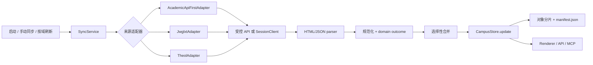

# THEIA 数据抓取--数据存储操作手册

> 本文档描述当前实现的实际行为，重点回答：数据从哪里来、什么时候抓、如何判定结果、最后落到哪里。本文不包含真实账号、Cookie、接口响应或个人样本数据。

## 0. 先说结论

THEIA 不是“每次启动把所有网页重新爬一遍”。它采用以下边界：

1. 个人教务快路径由 `SyncService` 调度，教务 API（启用且有独立凭据时）优先，浏览器统一认证是兼容和回退通道。
2. 培养计划 PDF、成绩明细等教务扩展页面不加入前台快速同步；登录完成后只对缺失的培养计划 PDF 做一次延迟、静默补抓，动态查询域仍由用户进入或明确请求触发。学业预警和毕设不进入本地数据层；全校课表是选课使用的独立本地目录，不属于 `academicExtras`。
3. 解析结果先经过来源、时间、完整性和空结果语义判断，再与旧快照合并。失败或含义不明的空结果不会抹掉旧数据。
4. `CampusStore` 将规范化的 `CampusState` 写成带 SHA-256 引用的不可变分片，由 `data/manifest.json` 原子提交；`theia-feed.json` 和 loopback API 都是派生读取面。
5. 培养计划的官方 PDF 是附件事实，不再以乱码 HTML 记录代替：抓取时直接读取二进制并写入本地附件目录，打开时优先调用本地 IPC；缓存缺失时只修复当前这一份本地文件，不等待其它同步，也不直接把用户送到登录 URL。只有确实缺少认证时才走静默认证或人工 fallback，来源页面仍必须由用户单独点击。
6. API 会话和 Electron 浏览器会话是两个不同的 Cookie 容器。已验证的浏览器会话点“来源页面”直接打开；首次或状态未知时才在同一浏览器分区隐藏加载并验证页面。已保存密码的启动认证会预热真实浏览器会话，认证完成后目标页直接打开，不重复隐藏加载。只有确实未认证、验证码、表单变化或超时才进入人工 fallback。

## 1. 总体链路



核心原则是“一次抓取、一个事实来源、多种只读消费者”。渲染器、顾问、MCP 和本机 API 不各自再抓校园网页，也不各自维护一份学业数据库。

## 2. 抓取入口和触发条件

| 入口 | 代码位置 | 默认行为 | 是否抓扩展域 |
| --- | --- | --- | --- |
| 应用启动 | `electron/main.mjs:startServices` | 加载本地快照、启动服务、读取认证/缓存状态；不因为打开应用就抓所有扩展页。 | 否 |
| 手动同步 | `theia:sync-now` -> 前台热域同步 | 只读取课表、课程、成绩、考试、学期、已选课程和通知；完成后只延迟补抓缺失的培养计划 PDF。成绩明细、空闲教室等多请求域由用户进入或明确点击后读取；全校课表走选课目录流程。 | 否 |
| 资料域进入/“读取此域” | `theia:sync-domain` -> `syncNow({ sources: ['jwglxt'], domains: [domain] })` | 侧栏首次进入未采集域立即读取；已有 `capturedAt` 的域只显示本地快照。按钮可强制重新读取当前域，保留其它域不变。 | 是，目标域 |
| 自动同步 | `SyncService.configureAutoSync()` | 按设置间隔静默运行，只更新 JWGLXT 的 `schedule`、`exams`、`notices` 和 THEOL 的 `courses`、`notices`；同一轮未结束不会重入。 | 否 |
| 全校课表 | `CourseSelectionService` / `dataCatalog.schoolSchedule` | 选课查询或显式归档扫描时请求；完整缓存的学期不重复抓。 | 不属于 `academicExtras` |
| 校历/体测 | `AcademicCalendarAssetsService`、体测 catalog | 按资产/年份缓存和刷新边界读取。 | 不属于快速同步 |
| 点“来源页面” | `openSourceWindow()` | 只打开页面，不把页面重新解析进 `CampusState`；已验证会话直开，状态未知时才做隐藏认证探测。 | 否 |

### 2.1 启动顺序

`startServices()` 先创建 `CampusStore`，加载或恢复 manifest；然后创建凭据 vault、`SessionClient`、教务 API client、`SyncService`、课程工作区和 loopback API。store 订阅负责广播 snapshot 并排队写 `theia-feed.json`，选课 sentinel 和自动同步在服务就绪后恢复。

启动只做必要的服务探测和本地加载；已有健康旧数据时不应为了制造活动感而重新抓取低变化资料。

## 3. JWGLXT 抓取调用链

```text
SyncService.syncNow({ sources: ['jwglxt'], domains? })
  -> AcademicApiFirstAdapter.sync()
     -> API 已启用且有凭据：AcademicApiClient.login() + JwglxtAdapter.sync()
     -> API 未启用/无凭据：JwglxtAdapter(SessionClient).sync()
     -> API 某些域失败：只对失败域尝试一次浏览器回退
  -> source/domain outcome
  -> SyncService.commit()
```

API client 使用独立内存 Cookie jar，不能把 API 登录得到的 Cookie 写入 Electron 的 `persist:theia` 浏览器分区。API 登录成功只代表 API 能读数据，不代表用户可以直接打开浏览器页面。

### 3.1 快路径域

`core/adapters/jwglxt.mjs` 的普通同步覆盖：

| 域 | 状态字段 | 典型来源 |
| --- | --- | --- |
| `profile` | `profile` | 教务首页 |
| `terms` | `terms` | 首页/课表索引的学期选择 |
| `courses` | `courses` | 课程及教学班 |
| `schedule` | `schedule` | 学生课表端点，按学期解析 |
| `grades` | `grades` | 成绩端点，保留重修尝试 |
| `exams` | `exams` | 考试端点 |
| `selected-courses` | `selectedCourses` | 已选课程查询 |
| `academic-progress` | `academicProgress` | GPA、学分统计和培养要求树；前台快同步不阻塞，缺失时静默补抓 |
| `notices` | `notices` | 教务通知 |

空学期、未定位课表行、成绩接口拒绝全量查询等情况由 adapter 记录为部分或失败 outcome，不把“接口返回空”直接解释为学生没有数据。

### 3.2 扩展域和只读路由

扩展域白名单以 `core/jwglxt-extra.mjs:JWGLXT_ACTIVE_EXTRA_DOMAIN_NAMES` 为准，当前启用培养计划 PDF（`N153540`）、毕业审核、成绩明细、考试附加和空闲教室 5 个只读域。学业预警和毕设与论文属于显式忽略域：不会抓取、索引、暴露或保留旧快照内容。全校课表、按周课表、档案与事务等重复或低价值页面同样不再进入当前模型；源码仅保留路由描述用于兼容清理。专业确认动作页（`N109310`、`N109510`）不在白名单内，既不作为培养计划抓取入口，也不会执行确认动作。

扩展路由只允许读取页面或明确的查询端点。代码不会点击确认、提交、上传、删除或调用其它学校侧写入动作。并发数、详情条数和总查询数都有上限，避免一次按域刷新拖垮校园系统和桌面 UI。

```text
read domain
  -> JwglxtAdapter.fetchExtraRoute()
     -> GET 页面，读取筛选表单和 data-func_widget_guid
     -> 对白名单 endpoint 发受控 POST/GET
     -> parseJwglxtExtraJson() 或 parseJwglxtExtraPage()
     -> mergeExtraDomainValues()
  -> academicExtras.domains[domain]
```

`mergeExtraDomainValues()` 优先保留首次读取的渲染页面 `sourceUrl`。查询 POST/JSON endpoint 只用于抓取，不再覆盖用户点击“来源页面”时应打开的页面地址。

## 4. 解析规则和培养计划修复

### 4.1 HTML jqGrid

`parseJwglxtExtraPage()` 按以下顺序过滤：

1. 排除 `ui-jqgrid-htable`、`ui-pg-table`、`navtable`、右侧操作表等表头/分页器。
2. 只把 `ui-jqgrid-btable` 或明确 `role="grid"` 视为数据表；普通详情表才使用 label/value fallback。
3. 排除嵌套在单元格下拉菜单中的表，以及嵌套表中的 `<tr>`。
4. 排除 `jqgfirstrow`、`emptyrow`、`请选择筛选条件`、`没有符合条件记录`、`暂无数据` 等占位行。
5. 按表头位置保留空单元格，避免隐藏列导致后续字段错位。
6. 单元格优先使用 `title` 属性；读取外层文本时移除嵌套 `table/ul/ol/script/style`。
7. “操作、排序、清空、来源、选择、查看、详情”等 UI 表头不进入业务字段。

因此“志愿 / 收起 / 状态 / 专业”只能出现在控件或表头时，不会被保存成培养计划记录。真实业务行仍会保留“专业”“状态”等字段，标题优先取专业、课程、论文等业务字段。

加载旧快照时还会做一次兼容清理：只有当一条历史记录的全部字段值都属于上述控件词时才删除；包含真实专业、课程或状态值的记录不会被这条规则误删。这样升级后不必先成功联网重抓，旧的纯 UI 伪记录也不会继续显示。

### 4.2 JSON envelope

`parseJwglxtExtraJson()` 只沿白名单数组键（`items`、`rows`、`data`、`records` 等）寻找记录，最多解包有限层数；字段名经过 alias 映射，学号、课程号、内部 ID 默认保持字符串，只有已知数值字段才转数字。原始 `html/raw/body/content` 不进入状态。

### 4.3 培养进度树

`academic-progress` 与 `academic-plan` 不是同一件事：前者是 GPA、完成/未完成统计和要求树，后者是教务扩展页面的只读表格/执行计划记录。前者优先使用官方树，必要时从嵌入标记和详情端点补全；推断树会标记 `partial` 或 `inferred`，不能冒充官方完整树。

## 5. 空数据、失败和旧数据语义

| 现象 | 语义 | 是否覆盖旧记录 |
| --- | --- | --- |
| 未请求，域不存在 | `unknown` / 尚未读取 | 否 |
| 成功且服务器明确无记录 | `complete` + `emptyConfirmed: true` | 是，可清空该域 |
| 有筛选控件但没有可靠结果 | `partial`，`emptyConfirmed: false` | 否，保留旧记录 |
| 请求失败/需要认证 | `failed` 或 `auth-required` | 否 |
| 只成功部分路由/学期 | `partial` | 只替换成功范围 |
| 旧记录存在但本轮失败 | `retainedPrevious: true` | 旧数据继续可读，但显示失败/过期 |

`emptyConfirmed` 只描述最近一次成功且完整尝试；`contentEmptyConfirmed` 描述当前保留内容曾否被完整来源确认过为空。一次失败不能冒充新的空确认，也不会抹掉先前成功确认的空结论。

看到 `records.length === 0` 时先读 `sync.domains.<domain>` 的 status、completeness、emptyConfirmed、retainedPrevious，再读 `capturedAt`/`attemptedAt`/`sourceSucceededAt` 和 `sync.sources.<source>.authRequired/error`。不能用顶层 `updatedAt` 推断某个域已经抓过，也不能把空数组直接回答成“学校没有这项数据”。

## 6. 存储布局和提交协议

默认根目录是 `%APPDATA%\\THEIA`；开发/测试可用 `THEIA_DATA_ROOT` 隔离：

```text
%APPDATA%\THEIA\
  data\
    manifest.json                 当前提交清单
    manifest.json.bak             上一份可回退清单
    objects\<kind>\<sha256>.json  不可变状态分片
  buct-data.json                  旧版迁移来源，保留但不作主库
  theia-feed.json                 从已提交快照派生的 Feed
  api-runtime.json                运行中的 loopback API 元数据
  auth-diagnostics.ndjson         脱敏认证诊断
  session\                       Electron 浏览器会话，禁止读取/导出
  course-work\                   课程任务工作区
  course-selection\              选课目标和审计 journal
  academic-calendar\             官方校历资产、分析和培养计划 PDF
```

`CampusStore.stateFragments()` 当前至少包含：

| 分片 | 内容 |
| --- | --- |
| `state/meta` | 应用版本、创建/更新时间 |
| `state/profile`、`state/settings`、`state/sync` | 资料、非秘密设置、同步状态 |
| `academic/terms`、`academic/courses`、`academic/schedule`、`academic/exams`、`academic/grades`、`academic/selected-courses`、`academic/progress`、`academic/extras` | 教务业务域 |
| `coursework/assignments`、`coursework/workspaces` | THEOL 任务和工作区元数据 |
| `communication/notices`、`communication/emails` | 通知和邮箱 |
| `catalog/index` | 体测、校历等 catalog 元数据 |
| `catalog/school-schedule/<term>` | 每个完整学期全校课表的独立动态片段 |

### 6.1 教务 PDF 附件的本地优先链路

培养计划 `N153540` 的抓取顺序是：

```text
计划索引（页面 + 一次查询）
  -> 选定计划 ID
  -> 计算稳定附件 ID（SHA-256 前缀）
  -> academic-calendar/assets/<id>.pdf 已存在：直接复用，不请求远程 PDF
  -> 不存在：通过 SessionClient 或 AcademicApiClient.binary() 下载，限制 32 MB
  -> 原子写入临时文件并 rename，并移除先前培养计划 PDF
  -> CampusState 只保存 id、filename、bytes、sha256、capturedAt、sourceUrl 等元数据
```

附件根目录来自 Electron 的 `app.getPath('userData')`，通常是 `%APPDATA%\\THEIA\\academic-calendar\\assets`；校历的教学进程表、周历和当前专业培养计划 PDF 共用该目录。旧 `data\\attachments\\jwglxt` 缓存会在启动时迁入，且清理规则只移除旧培养计划哈希文件，不会删除校历 PDF。渲染器和 Agent 不会拿到本地绝对路径；培养计划在受限 `theia-calendar:` 协议下按当前快照中的不透明附件 ID 提供本地只读预览，与校历 PDF 复用相同的卡片和对话框阅读器。缓存缺失时 IPC 只对当前 `sourceUrl` 发起一次受限二进制修复，并通过 `%PDF-` 文件头校验；如果二进制请求发现认证失效，已保存密码走隐藏认证，没有凭据才显示人工 fallback；其它修复失败或系统打开器失败时只报告本地错误，不自动打开来源登录页。来源页面是独立的显式动作。

培养计划只抓索引和官方 PDF，不再并发请求课程、修读要求、班级、专业方向四类碎片，也不持久化索引表格行。只有页面/资料能够证明当前专业时才选定一个稳定计划 ID；专业标识缺失或候选不明确时，结果标为部分并保留此前已验证的本地 PDF，绝不以其它专业的首条结果替换它。成功写入新文件后附件目录和 `academicExtras.academic-plan` 都只保留这一份 PDF。

默认 JWGLXT 快同步不会“覆盖”扩展域：培养计划 PDF 的查看动作直接绕过同步队列修复单个附件；其它扩展域在快路径结束后单独启动目标域请求，不会把一次不包含该域的同步当成命中。

### 6.2 原子提交和恢复

每次 `CampusStore.update()` 在写锁内重新读取当前提交视图，计算每个分片的 SHA-256，先写临时对象再 rename，生成新 revision，备份旧 manifest，最后原子替换 `manifest.json`。完成后刷新 `snapshotWithRevision()` 的 `{ state, revision, committedAt, domainDigests }`。

加载时主/备 manifest 都检查 schema、路径边界、分片 kind 和 digest。单个对象损坏时可从另一份 manifest 恢复；必需片段两边都不可恢复时，保持原文件不动并报错，不用空状态覆盖用户数据。动态全校课表片段按学期增加或显式移除，不能因为普通同步缺少该域就误删。

## 7. 数据生命周期和重抓策略

以下数据带时间戳即可作为旧资料使用，不需要每次启动重抓：

- 教务扩展域：用户首次进入未采集域或明确点击“读取此域”时刷新；已有 `capturedAt` 的域直接显示本地快照；
- 培养计划 PDF：附件文件存在且附件 ID 未变时不再下载，查看动作直接打开本地文件；
- 体测：按 `yearKey` 缓存，已有完整年份默认命中；
- 官方校历/PDF/图片：按官方 URL、资产 manifest 和下一刷新边界判断，源地址未变不重复下载；
- 全校课表：按学期保存 `complete`、`capturedAt`、`parserVersion`，完整且版本不变时归档扫描跳过；
- 邮箱正文：首轮只取元数据，正文/附件按需读取并本地缓存。

会话生命周期如下：

| 场景 | 行为 |
| --- | --- |
| 健康浏览器 Cookie | 复用 `persist:theia`，正常打开来源页；启动不强制全量重抓。 |
| 已保存统一认证密码、浏览器会话失效 | 后台 actor 静默认证并预热浏览器会话；默认 20 秒内完成，验证码、表单变化或超时才展示窗口。 |
| 仅教务 API 凭据有效 | API 数据可同步；来源页面仍必须通过浏览器隐藏探测并单独认证。 |
| 用户明确点击登录 | 可主动展示认证窗口，并重新启用同步。 |
| 显式退出 | 递增 auth epoch，取消旧 actor/请求，关闭窗口并清除浏览器会话；旧异步结果不得回写。 |

仅为打开来源页或修复单个 PDF 而触发的认证带有 `skipSync` 标记：认证完成后直接释放等待中的动作，不强行再跑一轮完整同步；用户明确手动登录刷新前台热域，保存密码后的后台认证只在发现培养计划 PDF 缓存缺失时延迟补抓这一份静态附件，不重复抓健康的旧资料。成绩明细、空闲教室等需要按学年学期或筛选条件展开的域仍由用户进入或明确点击后读取，首次读取后保存在本地；全校课表仍由选课目录按学期维护。

旧数据可以继续用于离线阅读，但必须把“可读”与“新鲜”分开：记录上的 `capturedAt`、域 outcome 的 `sourceSucceededAt` 和完整性字段一起决定可信范围。旧数据不是新数据；保留它比用一次失败的空响应覆盖更安全。

## 8. UI、Agent、MCP 的读取面

### 8.1 桌面 UI

React 通过 preload bridge 获取认证状态、sync progress 和用户数据投影。普通展示优先读取有界的 `getUserDataOverview`、`getUserDataDomainSummary`、`getUserDataRecords`：它们只返回中文状态、数量、当前优先的分页记录和安全附件 metadata，不把 raw、URL、内部 ID、正文或整段历史数组交给页面。完整 `getSnapshot` 仍保留给同步结果、兼容页面、导出和需要完整关系的本地计算，不是普通列表的默认读取合同。`AcademicRecordsView` 的扩展域列表使用 overview 计数，记录表使用按域/搜索/类型/页码的 records IPC；培养计划 PDF 按钮先走本地附件 IPC，来源按钮不直接拼 URL，也不绕过主进程 URL policy。

### 8.2 进程内 Agent

`AdvisorRuntime` 从 `CampusStore.snapshotWithRevision({ clone: false })` 获取一份已提交版本化视图，在惰性工具调用时按域投影。当前不为整份状态额外创建“冻结数据副本”：revision、domain digest 和请求边界负责一致性，工具只 materialize 当前需要的小片段。模型只能读经过脱敏和限长的 DTO，不能访问网络、浏览器、凭据、原始 HTML 或写 IPC。

### 8.3 外部 MCP

`integration/theia-mcp.mjs` 通过本机 API 读取当前 snapshot，并在读取前后校验 manifest revision，防止把并发提交前后的数据拼在一起。工具是有界只读面：健康、校园记录/本地事实搜索、截止事项、学业进度、学业分析、课程分析、单封邮件正文和显式放入 `local-docs` 的文档读取。MCP 不暴露 raw snapshot、Cookie、凭据、认证会话、绝对路径或学校写入动作。

```text
MCP tools/call
  -> discover api-runtime.json / loopback API
  -> read manifest revision
  -> GET bounded DTO
  -> read manifest revision again
  -> unchanged: return; changed: SNAPSHOT_CHANGED / retry
```

## 9. 手工验收清单

### 9.1 培养计划

1. 教务会话有效时进入“培养方案与教学执行计划”。
2. 读取 `N153540`：仅当前专业的一个官方 PDF 能进入本地缓存；索引、课程、要求和控件文本都不得成为记录。
3. 缺少专业标识或返回多个无法验证候选时，不得下载其它专业 PDF；已有的已验证本地 PDF 必须保留。
4. 检查旧快照或菜单中出现的 `N109310`、`N109510` 专业确认动作页：它们不应触发培养计划抓取。
5. 检查 `academic-extras/{domain}` 或诊断：PDF `sourceUrl` 应是官方预览路由，不是 POST/JSON 查询 endpoint；附件目录只能有当前这一份 PDF。

### 9.2 来源页面和登录

1. 保存统一认证密码但清掉浏览器会话，点击任意教务“来源页面”。
2. 预期先隐藏探测；自动认证成功时不显示登录窗口，随后打开来源页。
3. 模拟验证码/改版表单或等待后台超时：只在 fallback 时显示手动窗口。
4. 只配置教务 API 凭据、没有浏览器 Cookie：API 数据可同步，但来源页面必须触发浏览器认证。
5. 完成认证后再次点击同一来源页，预期复用 `persist:theia`，不重复要求登录。

### 9.3 存储和恢复

1. 同步前后比较 manifest revision 和目标分片 digest。
2. 修改一个设置时确认无关成绩/课表片段不被重写。
3. 在测试数据根中损坏一个最新对象，启动应用，确认从 manifest backup 恢复并记录 recovery。
4. MCP 连续读取时中间触发一次同步，确认返回 `SNAPSHOT_CHANGED` 或重试，而不是混合两个 revision。

## 10. 维护质量门槛

```powershell
cd H:\work\THEIA
npm test
npm run build
npm run lint
git diff --check
```

涉及 Electron 主进程、preload 或 IPC 时还要重启 Electron 做真实桌面验收；涉及登录时分别测试“浏览器 Cookie”“只有 API 凭据”“已保存统一认证密码”“无凭据人工登录”。涉及新域时必须补 allowlist、parser、domain outcome、merge/retention、schema/导出可见性（如适用）和空/失败/部分结果测试。

当前事实优先级是：代码和测试 > 本手册 > 旧设计文档。发现不一致时，先补测试和代码，再在同一变更中更新本文和 [数据生命周期](data-lifecycle.md)。
